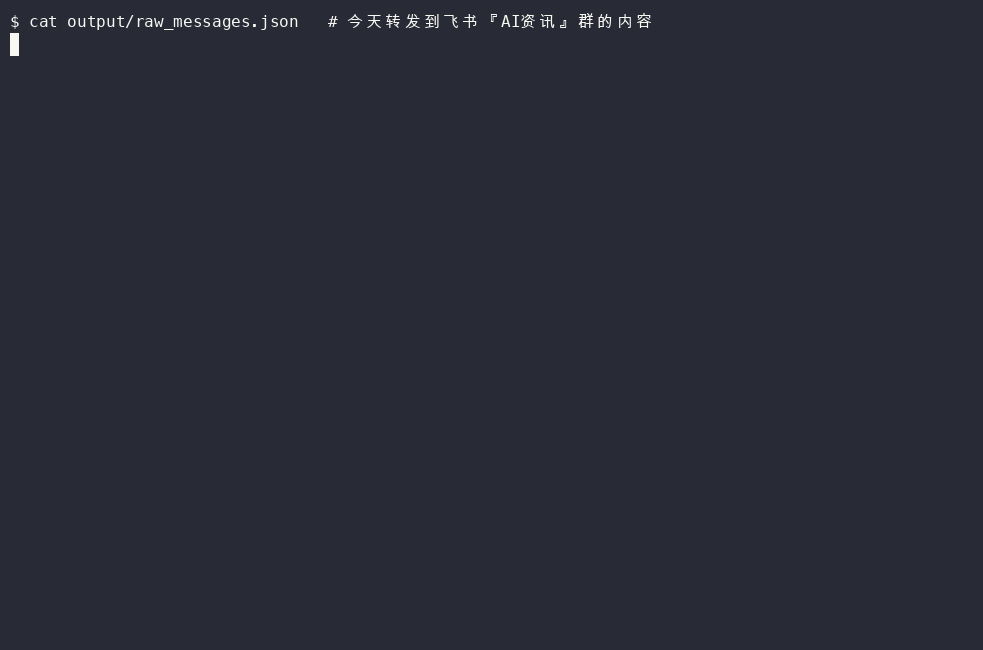

# AI 资讯自动播客化

把每天转发到飞书"AI资讯"会话里的 AI 竞品动态/模型发布/方法论素材，自动整理成一期双人对话播客 + TL;DR 文字摘要。



已打包成 Claude Code Skill（`SKILL.md`），软链接在 `~/.claude/skills/ai-agent-digest`，
拿到这个文件夹配好 `.env` 就能直接用，跟这份文档的其他 Skill 是同一套用法。

详细方案见 plan：`~/.claude/plans/modular-pondering-waffle.md`

## 链路

```
飞书"AI资讯"会话 → fetch_lark_messages.py → extract_content.py → generate_script.py → synthesize_audio.py → episode.mp3
```

`run_daily.py` 依次跑通以上四步（MVP 阶段手动触发，暂无 RSS 发布和定时自动化）。

## 已验证可用的凭证（写在 `.env`，不进 git）

- `LARK_CHAT_ID`：飞书"AI资讯"群的 chat_id，已配置
- `VOLC_SPEECH_API_KEY`：火山引擎新版控制台的语音 API Key（AppID 1968008334，已开通"语音合成2.0"），用于 Phase 4 经典 TTS
- `ARK_API_KEY` / `ARK_CHAT_MODEL`：火山方舟专属 API Key（`ai-agent-digest`）+ 模型 ID `doubao-seed-2-1-pro-260628`，用于 Phase 3 脚本生成，直连 ARK OpenAI 兼容接口，不依赖 `arkcli` 登录

放弃了最初计划里的"豆包语音播客大模型"直连方案——它只支持预购买 token 包（最低 ¥70,000），对个人项目不划算；改用经典语音合成 2.0 按字符量计费，Phase 4 里对每句话分别合成再用 ffmpeg 拼接。

## 目录结构

- `fetch_lark_messages.py` — Phase 1，拉取"AI资讯"会话最近 N 小时消息（`--hours` 可调，默认 24）
- `extract_content.py` — Phase 2，公众号文章抓正文；YouTube 视频拉官方字幕轨道；Twitter/X 用官方 oEmbed 接口取推文正文；小红书链接不抓取（无公开 API，抓取需绕过反爬有封号风险），只用分享自带的标题/摘要文本
- `generate_script.py` — Phase 3，调用方舟对话模型生成 TL;DR 摘要 + "甲/乙"双人对话稿，小红书这类内容不足的素材会如实说明"仅有标题"，不编造细节
- `synthesize_audio.py` — Phase 4，逐句调用经典语音合成 2.0（甲=云舟男声/乙=Vivi女声），ffmpeg 按顺序拼接成一期音频
- `run_daily.py` — Phase 5，手动触发全链路
- `demo/` — `record_demo.sh` 一键复现全流程录制脚本 + 已生成的 `demo.gif`（用真实素材跑出来的，不是摆拍）
- `output/` — 每次运行的中间产物（`raw_messages.json` / `materials.json`）和最终产出 `summary.md` / `script.md` / `episode.mp3`

## 日常使用

1. 刷到想追踪的 AI 资讯（竞品动态/模型发布/方法论），转发到飞书"AI资讯"会话
2. 攒够一天的量后，运行：

```bash
cd ~/Documents/ai-agent-digest
python3 run_daily.py
```

3. `output/script.md` 建议先人工扫一眼（尤其是没把握的内容），确认没问题再听 `output/episode.mp3`

## 首次环境搭建（新机器上）

```bash
pip3 install -r requirements.txt
cp .env.example .env  # 参照已有 .env 填入四个凭证
```

## 尚未做的部分

- RSS 订阅源生成 + 公网托管，做完才能用小宇宙/Apple Podcasts 订阅收听
- 每日定时自动触发（建议用 Vercel Cron，不要依赖 Claude Code 会话内的 CronCreate——那个 7 天会过期，且需要会话保持打开）
